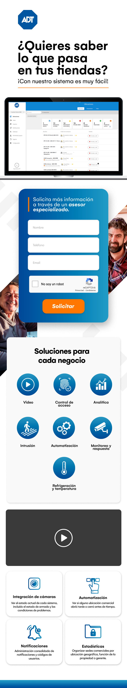

# Desafío Técnico LFi - Landing Page ADT

Este proyecto es parte de mi desafío técnico para la posición de desarrollador HTML en LFi. Consiste en crear una _landing page_ para ADT, presentando sus soluciones de seguridad para negocios.

## Capturas de Pantalla

### Versión de escritorio

### Versión móvil

## Características

- Diseño responsivo para una experiencia óptima en dispositivos de diferentes tamaños.
- Formulario de contacto interactivo con validación de campos y Google ReCAPTCHA.
- Presentación visual de las soluciones de seguridad ofrecidas por ADT.
- Reproducción de video para mostrar el servicio en acción.

## Tecnologías utilizadas

- HTML5
- CSS3 (Flexbox para diseño y media queries para la respuesta)
- JavaScript (para la integración de Google ReCAPTCHA)
- Google ReCAPTCHA (protección contra spam)
